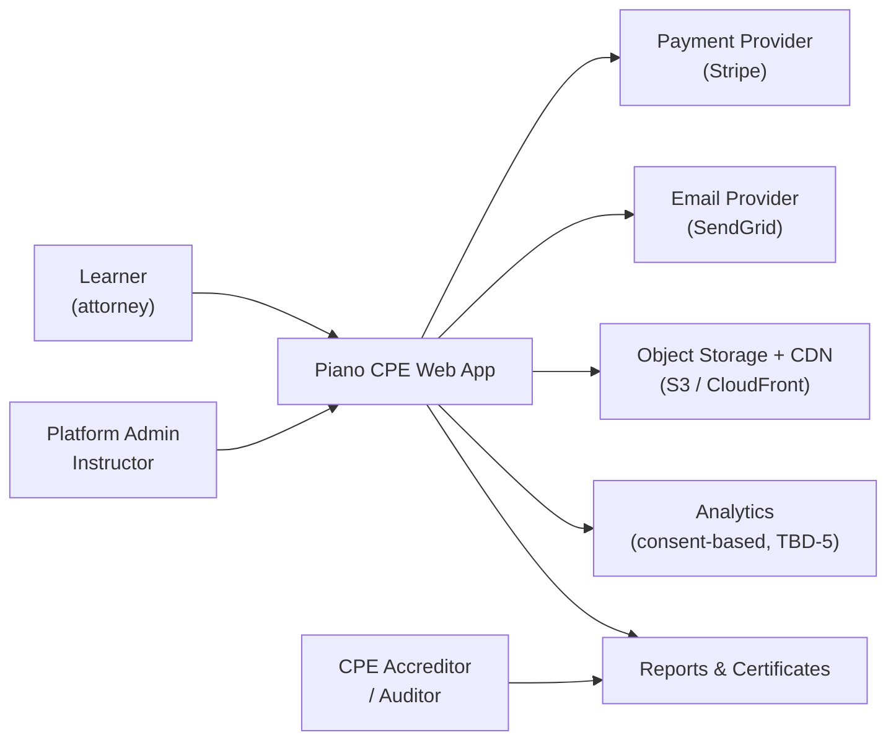
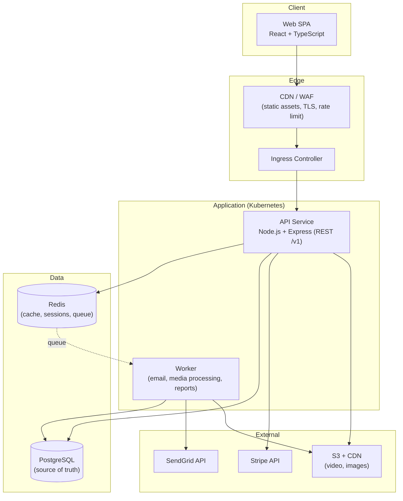
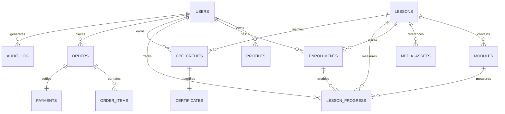
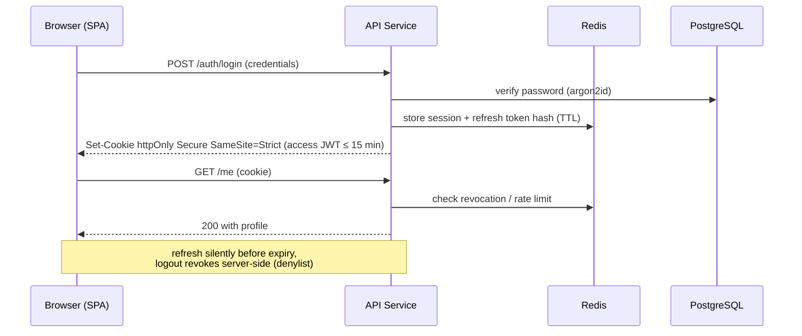
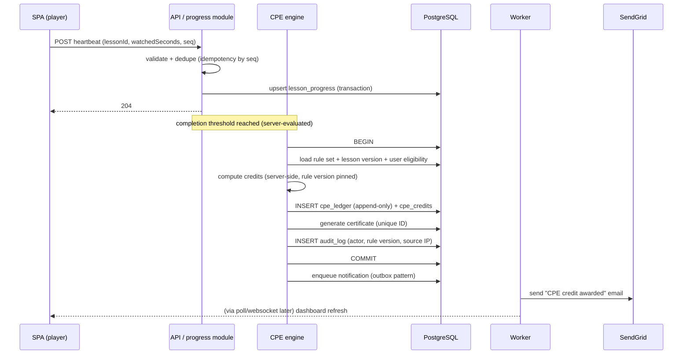
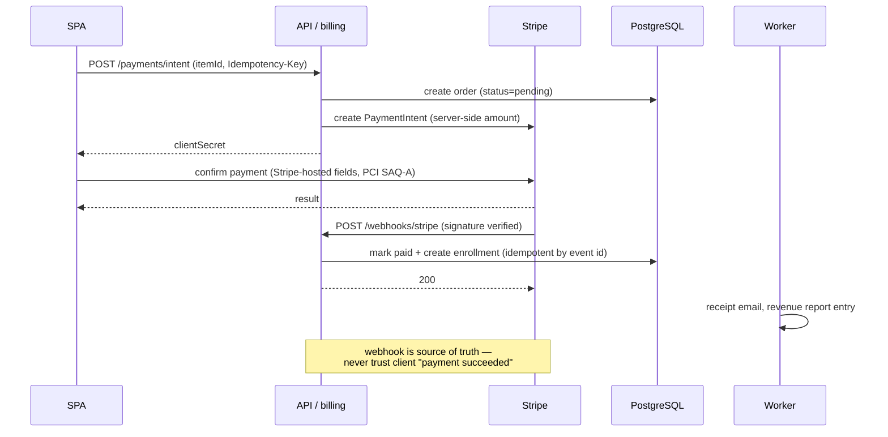

# System Architecture — Piano Website (CPE for Legal Professionals)

> **Normative document.** All development activities MUST adhere to this architecture
> (see `CLAUDE.md` → *Core Rule: System Architecture Compliance*). Deviations require an
> Architecture Decision Record (ADR) and team approval.

---

## 1. Document Control

| Field | Value |
|---|---|
| Version | 2.0 |
| Status | **Draft for review** (supersedes v1.0) |
| Date | 2026-10-06 |
| Owner | Project Architect (maintainers of this repo) |
| Reviewers | Product Owner, Tech Lead, Security Reviewer |
| Review cadence | Every milestone release, or on any architectural change |
| Framework | Aligned with ISO/IEC/IEEE 42010, arc42, C4 model; templates from `claude-skills/skills/architecture-designer/` |

### 1.1 Change Control

1. Edit this file only through a reviewed pull request.
2. Any change to Sections 5–10 (views, data, API, workflows, security, reliability) requires a new or updated ADR in Section 14.
3. Bump the version in the table above and add a row to Section 19 (Change Log).
4. Update `CLAUDE.md` / `SKILL.md` cross-references if section names change.

### 1.2 Related Documents

| Document | Purpose |
|---|---|
| `CLAUDE.md` | Project rules; makes this document binding |
| `SKILL.md` | Skill-selection guide mapped to this architecture |
| `claude-skills/skills/architecture-designer/` | ADR, NFR and system-design templates used here |
| `docs/adr/` *(to be created)* | Full-length ADRs once the first one is split out |

---

## 2. Overview

### 2.1 Purpose

A web platform that delivers **piano lessons** and awards **Continuing Professional Education (CPE) credits**
to legal professionals. The system must be simultaneously an e-learning product (content, progress, media)
and a **compliance record system** (verifiable, auditable CPE credit issuance and reporting).

### 2.2 Scope

**In scope (v1):** responsive web app, interactive piano keyboard, video lessons, progress tracking,
server-side CPE credit calculation and certificate issuance, payments, transactional email, admin/reporting,
deployment and observability.

**Out of scope (v1):** native mobile apps, live streaming, AI recommendations, multi-language, LMS/SCORM
federation — see Section 16 (Roadmap).

### 2.3 Quality Attribute Priorities

Ordered by importance; when trade-offs are required, higher wins:

1. **Correctness & auditability of CPE credit records** (domain-critical)
2. **Security** (PII, payment data)
3. **Reliability / availability** of lesson delivery
4. **Accessibility** (WCAG 2.2 AA — mandatory for professional-education audiences)
5. **Performance**
6. **Modularity / maintainability**
7. **Cost efficiency**

---

## 3. Stakeholders & Concerns

| Stakeholder | Primary concerns | Sections addressing them |
|---|---|---|
| Learner (attorney) | Fast, accessible, works offline-ish, clear credit progress | 4, 8, 11, 13 |
| CPE compliance officer / auditor | Verifiable credit records, certificates, exportable reports | 4.4, 6.1, 8.2, 9.2 |
| Instructor / content admin | Authoring, publishing, media upload | 5.6, 7.2 |
| Platform admin / ops | Deployment, monitoring, cost, incident response | 12, 13, 15 |
| Security & privacy reviewer | AuthN/AuthZ, PCI scope, PII handling, OWASP | 9 |
| Payment/finance | Correct charging, refunds, revenue reconciliation | 8.3, 9.4 |
| Regulators (bar / CPE accrediting bodies) | Credit rule compliance, retention, audit trail | 4.4, 6.3, 8.2, 9.5 |

---

## 4. Requirements

### 4.1 Functional (summary)

| ID | Requirement | Priority |
|---|---|---|
| FR-01 | Register, authenticate, manage profile (learner) | Must |
| FR-02 | Browse, purchase and consume video lessons | Must |
| FR-03 | Interactive piano keyboard practice interface inside lessons | Must |
| FR-04 | Track lesson progress; persist and resume across sessions | Must |
| FR-05 | Compute and award CPE credits from verified completion time | Must |
| FR-06 | Generate downloadable completion certificates with unique IDs | Must |
| FR-07 | Admin: CRUD lessons, upload media, publish/unpublish | Must |
| FR-08 | Admin: report on users, completions, credits issued (CSV/PDF export) | Must |
| FR-09 | Process payments (cards) and issue receipts; refunds | Must |
| FR-10 | Transactional email: welcome, receipt, credit awarded, reminders | Should |
| FR-11 | Video player: play/pause, seeking, speed, captions | Must |
| FR-12 | Enrollment/bundles and promo codes | Could |

### 4.2 Non-Functional Requirements (measurable targets)

> Targets below are **proposed** and marked ⚠ until confirmed by the Product Owner (Section 4.5).

| Category | Target |
|---|---|
| **API performance** | p95 ≤ 300 ms (reads), ≤ 500 ms (writes); p99 ≤ 1 s ⚠ |
| **Page load** | LCP ≤ 2.5 s at p75 (Core Web Vitals), TTFB ≤ 500 ms ⚠ |
| **Database** | Query p95 ≤ 50 ms on hot paths ⚠ |
| **Scalability** | 1,000 concurrent users at launch; 10,000 target; 5× peak/average ⚠ |
| **Availability** | 99.9% monthly (≤ 8.76 h/year downtime) ⚠ |
| **Reliability** | RPO ≤ 1 h, RTO ≤ 4 h ⚠ |
| **Accessibility** | WCAG 2.2 AA (audited each release) |
| **Browser support** | Last 2 versions of Chrome, Firefox, Safari, Edge; responsive 320 px → 1440 px+ |
| **Security** | OWASP Top 10 covered (Section 9.7); PCI DSS **SAQ-A** scope (Stripe-hosted fields only) |
| **Data retention** | CPE records + audit log retained per accrediting-body rule (assume ≥ 7 years ⚠); PII deletable on request |
| **Deploy frequency** | ≥ weekly, zero-downtime rolling deploys |
| **Observability** | 100% of services emit structured JSON logs, Prometheus metrics, health endpoints |
| **Cost** | Infrastructure budget ⚠ (stakeholder input required — see Risk R-03) |

### 4.3 Constraints

| Type | Constraint |
|---|---|
| Tech | Stack fixed by this document: React+TS, Node/Express, PostgreSQL, Redis, Docker/K8s (ADR-001…003) |
| Compliance | PCI DSS scope limited to Stripe-hosted fields — **card data never touches our servers** |
| Compliance | CPE credit rules defined by accrediting body; changes to the credit engine need domain sign-off |
| Team | Small team → modular monolith preferred over microservices (ADR-002) |
| Legal | Cookie/consent requirements for analytics; privacy policy for PII |
| Budget | ⚠ Kubernetes cost must be validated against budget (Risk R-03) |

### 4.4 Domain Rules (CPE)

1. Credits are computed **server-side only** — the client is never trusted for credit math.
2. Only **verified completion** (threshold of watched/interacted time) triggers credit — no credit on video seek-to-end.
3. Awarded credits are **immutable**; corrections are made via compensating entries, never by editing history (ledger, ADR-010).
4. Every credit event writes an **audit record**: who, what, when, rule version, source IP, lesson version.
5. Certificates carry a **unique verifiable ID** and a validation URL.

### 4.5 Assumptions & Open Questions (TBD)

| ID | Item | Owner | Status |
|---|---|---|---|
| TBD-1 | Exact CPE credit formula (minutes → credits) and per-jurisdiction caps | Product | Open |
| TBD-2 | Certificate retention period mandated by accrediting body | Product | Open |
| TBD-3 | Stripe vs. additional PayPal support | Product | Open (ADR-005) |
| TBD-4 | Monthly infrastructure budget | Product/Finance | Open |
| TBD-5 | Analytics tool + consent model (GA4 vs. privacy-first alternative) | Security/Privacy | Open (ADR-009) |
| TBD-6 | Need for offline lesson caching / PWA | Product | Open |

---

## 5. Architecture Views

### 5.1 Architectural Principles

| # | Principle |
|---|---|
| P1 | **Modularity first** — strict layer boundaries; no cross-layer shortcuts |
| P2 | **API is the contract** — UI and any future client (mobile) consume the same versioned REST API |
| P3 | **Server-side authority** — auth, credit math, pricing, entitlement checks execute only server-side |
| P4 | **Defense in depth** — validate at the edge *and* in the domain layer |
| P5 | **Design for failure** — every external dependency has a degradation path (Section 10) |
| P6 | **Evolution over rewrites** — smallest reversible change; ADR before structural change |
| P7 | **Accessible by default** — a11y is a definition-of-done item, not a hardening phase |

### 5.2 Context View (C4 Level 1)



### 5.3 Container View (C4 Level 2)



> **Shape decision:** modular monolith (one API service + one worker), *not* microservices — ADR-002.

### 5.4 Proposed Repository Structure (monorepo)

```
piano-cpe/
├── apps/
│   ├── web/            # React + TypeScript SPA
│   └── api/            # Express REST API + worker entrypoint
├── packages/
│   ├── shared/         # shared TS types, Zod schemas, API contract types
│   └── config/         # lint, tsconfig, env schema
├── infra/
│   ├── docker/         # Dockerfiles, compose.dev.yml
│   └── k8s/            # manifests / Helm charts (dev, staging, prod)
├── docs/
│   ├── adr/            # one file per ADR (see Section 14)
│   └── api/            # OpenAPI spec
└── SYSTEM_ARCHITECTURE.md
```

### 5.5 Frontend Components

| Component | Responsibility | Key rules |
|---|---|---|
| `auth/` | Login, register, refresh, logout, route guards | Never store tokens in `localStorage`; httpOnly cookies preferred (ADR-004) |
| `lesson-browser/` | Catalog, search, enrollment | Server-provided pricing only |
| `player/` | Video player, captions, speed, heartbeat progress | Emits progress heartbeat ≤ 30 s; idempotent |
| `piano/` | Interactive keyboard, exercises, MIDI-ready input | Pure/`requestAnimationFrame`-driven; no business logic beyond UX |
| `dashboard/` | Progress, credits earned, certificates | Read-only view of server-computed values |
| `billing/` | Checkout, receipts, payment method | Stripe-hosted fields only (PCI SAQ-A) |
| `admin/` | Lesson CRUD, media upload, reports | RBAC-gated (Section 9.2) |
| `shared/` | Design system, a11y primitives, API client, i18n-ready strings | Central API client enforces error model & retries |

### 5.6 Backend Components (modular monolith)

| Module | Responsibility | Owns tables |
|---|---|---|
| `auth` | Registration, login, JWT issue/refresh, password reset, MFA-ready | `users`, `sessions`, `audit_log` |
| `users` | Profiles, roles, preferences | `users`, `profiles` |
| `catalog` | Lessons, modules, media refs, publishing state | `lessons`, `modules`, `media_assets` |
| `enrollment` | Purchases → entitlements, bundles, promo codes | `orders`, `order_items`, `enrollments` |
| `progress` | Progress heartbeats, completion evaluation | `lesson_progress`, `module_progress` |
| `cpe` | **Credit engine**: rule evaluation, ledger, certificates | `cpe_credits`, `cpe_ledger`, `certificates` |
| `billing` | Stripe integration, webhooks, refunds, reconciliation | `payments`, `webhooks` |
| `reporting` | Admin queries, CSV/PDF exports | read-only views |
| `notify` | Email templates, enqueue via Redis queue | `notifications`, `outbox` |
| `admin` | CMS operations, RBAC enforcement | — |
| `core/` | Config, logging, errors, middleware, DB access | — |

**Dependency rule:** `core` → domain modules → `core`. Domain modules never import each other
directly; cross-module calls go through defined interfaces (prevents a distributed monolith).

---

## 6. Data Architecture

### 6.1 Entity Relationship Overview



### 6.2 Storage & Caching

| Store | Technology | Contents | Scaling |
|---|---|---|---|
| Primary OLTP | PostgreSQL 16 | All relational truth (above) | Single primary → read replicas at 10× (Section 11) |
| Cache | Redis | Session/token denylist, hot catalog, rate limits, job queue | Cluster mode when > 1 instance |
| Object storage | S3 + CDN | Video, images, generated PDFs | Origin + CDN; signed URLs for private media |
| Search | Postgres FTS initially | Lesson search | External engine only if FTS p95 misses target |

### 6.3 Data Rules

- **Source of truth = PostgreSQL.** Redis is disposable (flush-safe); no unique data lives only in cache.
- **Migrations** are versioned, forward-only, run as a CI/CD job before rollout; destructive migrations require an ADR + rollback plan.
- **Backups:** automated daily full + continuous WAL archiving → RPO ≤ 1 h; quarterly restore test → RTO ≤ 4 h.
- **PII minimization:** store only needed PII; encrypt sensitive columns at rest; documented deletion workflow (right-to-erasure) that preserves anonymized financial/CPE records.
- **Money & credits:** numeric types only (no floats) — `numeric(12,2)` for currency, integer minor units where possible.

### 6.4 Data Classification

| Class | Examples | Controls |
|---|---|---|
| Public | Lesson titles, pricing page | CDN cache, no auth |
| Internal | Progress, catalog metadata | Authenticated, RBAC |
| Confidential | PII, emails, addresses | Encrypted at rest, access-logged, least privilege |
| Restricted | CPE ledger, audit log, payment metadata | Append-only, immutable, retention policy, no hard delete |
| Prohibited | Raw card numbers, CVV, full track data | **Never stored** (Stripe-hosted fields only) |

---

## 7. API Architecture

### 7.1 Conventions

| Aspect | Rule |
|---|---|
| Style | REST, resource-oriented, JSON |
| Base path | `/api/v1` — breaking changes → `/api/v2` (never in-place) |
| Auth | httpOnly cookie session carrying short-lived JWT (ADR-004); `Authorization: Bearer` for machine clients |
| Validation | Zod schemas shared in `packages/shared` — same schema validates request **and** response types |
| Errors | RFC 7807 `application/problem+json`: `{ type, title, status, detail, errors[] }` |
| Pagination | Cursor-based `{ items, nextCursor }` for feeds; page-based for admin tables |
| Idempotency | `Idempotency-Key` header on payment/order endpoints |
| Rate limiting | Redis token bucket: 100 req/min/IP authenticated, 20 req/min/IP anonymous; 429 + `Retry-After` |
| Contract | OpenAPI 3 spec in `docs/api/api.yaml`, generated/validated in CI |

### 7.2 Endpoint Map (representative)

| Method | Path | Auth | Purpose |
|---|---|---|---|
| POST | `/auth/register`, `/auth/login`, `/auth/refresh`, `/auth/logout` | Public/Session | Auth lifecycle |
| GET | `/lessons`, `/lessons/:id` | Session | Catalog |
| POST | `/enrollments` | Session | Redeem purchase/bundle |
| POST | `/progress/:lessonId/heartbeat` | Session | Progress heartbeat (idempotent) |
| GET | `/me/progress`, `/me/credits`, `/me/certificates` | Session | Learner dashboard |
| POST | `/payments/intent` | Session | Create Stripe PaymentIntent |
| POST | `/webhooks/stripe` | Signature | Payment events (idempotent) |
| GET | `/me/certificates/:id/verify` | Public | Certificate validation URL |
| POST/PUT/DELETE | `/admin/lessons/**` | `instructor`,`admin` | Content management (RBAC) |
| GET | `/admin/reports/credits` | `admin` | CPE audit report (CSV/PDF) |

---

## 8. Key Workflows

### 8.1 Authentication & Session



### 8.2 Lesson Completion → CPE Credit (critical path)



**Invariants:** heartbeats are idempotent; credit computation happens in a single transaction;
the ledger is append-only (Section 4.4); failure at any step rolls back — *no credit without audit record*.

### 8.3 Payment



### 8.4 End-to-End Data Flow (v1 parity list)

1. User accesses site via browser (static assets from CDN).
2. SPA authenticates against the API; API validates and issues httpOnly session cookie.
3. SPA fetches catalog; API serves from Redis cache with Postgres fallback.
4. User selects a lesson; entitlement checked server-side.
5. Player streams video from CDN via signed URL; heartbeats persist progress.
6. Progress is saved every ≤ 30 s (idempotent heartbeat).
7. On verified completion the CPE engine computes and issues credits + certificate atomically.
8. Payments run through Stripe; fulfilment is driven by verified webhooks.
9. Worker sends transactional email (receipt, credit awarded, reminders).

---

## 9. Security Architecture

### 9.1 Authentication (AuthN)

- Passwords hashed with **argon2id** (memory-hard), peppered via secrets manager.
- **Access JWT ≤ 15 min** + rotating refresh token; server-side revocation denylist in Redis.
- httpOnly + Secure + SameSite cookies (XSS/CSRF resilient); CSRF token for state-changing cookie-auth routes.
- MFA for `admin`/`instructor` roles (required before production launch); MFA-ready schema from day one.
- Password reset: single-use, short-TTL token; identical response timing for existing/non-existing users.

### 9.2 Authorization (AuthZ) — RBAC Matrix

| Resource / Action | `learner` | `instructor` | `admin` |
|---|---|---|---|
| Read published lessons | ✅ | ✅ | ✅ |
| Submit progress, earn credits | ✅ (own) | ✅ (own) | ✅ (own) |
| View own credits/certificates | ✅ (own) | ✅ (own) | ✅ (own) |
| Create/edit/publish lessons | ❌ | ✅ | ✅ |
| Upload/manage media | ❌ | ✅ | ✅ |
| Manage users, roles, refunds | ❌ | ❌ | ✅ |
| View all users' CPE records / export reports | ❌ | ❌ | ✅ |
| View audit log | ❌ | ❌ | ✅ (read-only) |
| Modify credit ledger | ❌ | ❌ | ❌ (append-only; corrections = compensating entries) |

Enforcement: middleware does coarse role checks; each repository call re-applies **row-level ownership**
(`WHERE user_id = current_user`) — IDOR protection is never left to the UI.

### 9.3 Transport & Storage

- TLS 1.2+ everywhere, HSTS preload, HTTPS-only; TLS 1.3 where supported.
- Encryption at rest: database, backups, S3 (SSE), disks.
- Secrets via environment/secret manager — **never in code or images**; rotated quarterly and on personnel change.

### 9.4 Payment / PCI Scope

- **PCI DSS SAQ-A**: card data collected only in Stripe-hosted fields/Elements; no card data on our servers, logs, or support tools.
- Webhook signatures verified; replay protection via event-ID idempotency; amounts always computed server-side.

### 9.5 Input Handling & Application Security

- Zod validation on every request body/query/param; parameterized queries only (no string-built SQL).
- Output encoding + strict **CSP** (`default-src 'self'`; no `unsafe-inline` for scripts), `X-Content-Type-Options`, `Referrer-Policy`, `frame-ancestors 'none'`.
- CORS allowlist (no `*` with credentials).
- File uploads: server-side type/size sniffing, random stored names, served from separate origin.
- Dependency scanning (npm audit / Snyk) + secret scanning in CI; monthly patch cadence.
- Structured, tamper-evident **audit log** for auth, admin actions, refunds, and credit events (Section 8.2).

### 9.6 Privacy & Analytics

- Consent-gated analytics (no cookies before opt-out/opt-in per jurisdiction — TBD-5); IP anonymization; no PII in event payloads.
- Documented retention schedule + deletion workflow (Section 6.3).

### 9.7 OWASP Top 10 (2021) Coverage

| Risk | Control |
|---|---|
| A01 Broken Access Control | RBAC matrix + row-level ownership + automated authz tests (10.4) |
| A02 Cryptographic Failures | TLS/HSTS, argon2id, KMS-managed keys, encrypted backups |
| A03 Injection | Zod validation, parameterized SQL, strict CSP, ORM/query builder |
| A04 Insecure Design | Threat modeling per feature; credit ledger append-only by design |
| A05 Security Misconfiguration | IaC-managed config, least-privilege K8s RBAC, no default creds, hardened images |
| A06 Vulnerable Components | CI dependency + SAST scanning, pinned versions, renovate-style updates |
| A07 Auth Failures | argon2id, JWT ≤ 15 min, MFA for staff, rate limiting, lockout w/ backoff |
| A08 Data Integrity Failures | Signed webhooks, idempotent writes, checksummed migrations |
| A09 Logging Failures | Centralized audit log + alerts on auth/admin anomalies |
| A10 SSRF | No user-supplied URLs fetched server-side; egress allowlist |

---

## 10. Reliability & Resilience

### 10.1 Failure Modes

| Failure | Impact | Mitigation / Degradation |
|---|---|---|
| API instance crash | Brief 5xx | Rolling deploy, ≥ 2 replicas, liveness/readiness probes, LB removes unhealthy pod |
| PostgreSQL down | Writes fail, reads cached | Multi-AZ failover (RTO ≤ 4 h), read-only maintenance mode, queue writes |
| Redis down | Cache misses, queue stalls | Fall back to DB (slower but functional); alerts; rebuild cache; queue persisted/replayable |
| Stripe outage | New purchases blocked | Lessons remain reachable; graceful "payments unavailable" state; retry queue |
| S3/CDN outage | Video playback fails | Player error state + retry, preloaded first segment, status page alert |
| SendGrid outage | Emails delayed | Outbox pattern — emails re-sent when provider recovers; nothing lost |
| Traffic spike (5×) | Latency increase | CDN for static, autoscaling API 2→10, rate limiting, cache warming |
| Bad migration/deploy | Potential outage | Forward-only migrations, canary/rolling with automatic rollback on health-check failure |
| Webhook lost/duplicate | Wrong entitlement state | Reconciliation job compares Stripe ledger vs. local orders daily |
| Corrupted credit rule change | Compliance risk | ADR + domain sign-off required; rule version pinned per credit event (4.4) |

### 10.2 Health & Graceful Degradation

- `/healthz` (liveness), `/readyz` (readiness: DB + Redis checks) on every service.
- Feature flags allow disabling non-critical paths (payments, notifications) without deploy.
- Circuit breakers on external calls (Stripe, SendGrid) with timeout budgets: never hold a request > 2 s on a dependency.

---

## 11. Scalability & Performance

### 11.1 Current (MVP)

- Single region; 2 API replicas + 1 worker behind ingress/ALB.
- Managed PostgreSQL (single primary), Redis single instance, S3 + CDN for media.
- Static SPA on CDN; gzip/brotli; code-splitting per route.

### 11.2 Growth Path (→ 10× users)

| Pressure | Scale lever (in order) |
|---|---|
| Read traffic | API horizontal autoscaling → Redis cache hit-rate tuning → Postgres read replicas |
| Video bandwidth | CDN edge caching, HLS adaptive bitrate, signed URL TTL tuning |
| Writes (heartbeats) | Batched upserts, `session`-level aggregation, partition `lesson_progress` by month |
| Background jobs | Worker replicas scale on queue depth |
| Database ceiling | Connection pooling (PgBouncer), indexing per slow-query review, then read replicas; sharding only if proven necessary |
| Multi-region | Only if demand proven — geo-replicated CDN first, app-level multi-region last (avoid over-engineering, P6) |

**Non-goal:** microservices split before a measured need (ADR-002).

---

## 12. Deployment Architecture

### 12.1 Environments

| Env | Purpose | Data |
|---|---|---|
| `local` | Docker Compose (api, web, postgres, redis, mailpit) | Synthetic seed data |
| `staging` | Production-like QA + E2E + UAT | Anonymized subset |
| `prod` | Live | Real data, strict RBAC, backups on |

### 12.2 Pipeline (CI/CD)

```
lint → typecheck → unit tests → build images → SAST + dependency scan →
integration tests (testcontainers) → migrate staging → E2E (Playwright) →
deploy staging (canary) → smoke tests → manual gate → deploy prod (rolling, 10%→100%)
```

- Rollback automatic if error-rate/latency SLOs breach during rollout.
- Database migrations run before code that requires them; schema changes are backward compatible one release.

### 12.3 Production Topology

- **Docker** images (distroless base, non-root), **Kubernetes** in prod (Helm-managed), **Compose** for dev — ADR-007.
- Namespaces: `web`, `api`, `data`, `observability`; NetworkPolicies default-deny.
- Ingress: TLS termination, WAF/CDN in front, rate limiting.
- Managed services: Postgres (Multi-AZ), Redis, S3 — the team operates the app, not the database.

### 12.4 Observability

| Signal | Tool | Detail |
|---|---|---|
| Logs | Structured JSON → ELK | Correlation ID per request across SPA → API → worker |
| Metrics | Prometheus + Grafana | RED metrics per endpoint; saturation, cache hit rate, queue depth |
| Traces | OpenTelemetry (phase 2) | Trace the critical path (8.2) end-to-end |
| Alerts | Alertmanager | Error-rate, p95 latency, 5xx spike, disk/WAL, backup failure, webhook failures |
| SLOs | Grafana dashboards | Availability 99.9%, p95 ≤ 300 ms, burn-rate alerts |
| Frontend | RUM / Sentry | JS errors, LCP/CLS tracking with consent |

---

## 13. Testing & Quality Gates

| Level | Scope | Tooling (per `SKILL.md`) |
|---|---|---|
| Unit | Domain logic — **especially the CPE credit engine** (property-based edge cases) | Vitest/Jest |
| Integration | API + real Postgres/Redis via containers | Testcontainers |
| Contract | OpenAPI request/response conformance | Spec validation in CI |
| E2E | Purchase → lesson → completion → credit → certificate; admin flows | Playwright (`playwright-expert`) |
| Security | AuthZ matrix tests (every route × role), SAST, dependency scan | `security-reviewer`, OWASP ZAP baseline |
| Performance | p95 targets, load at 5× peak | k6/Artillery (`test-master`) |
| Accessibility | Automated axe + manual keyboard/screen-reader pass | WCAG 2.2 AA checklist |
| Coverage gate | ≥ 80% on `cpe`, `billing`, `auth` modules; ≥ 70% repo-wide | CI-enforced |

---

## 14. Key Architectural Decisions (ADR Index)

> Short-form ADRs below are binding. Long-form files go in `docs/adr/NNNN-*.md` using
> `claude-skills/skills/architecture-designer/references/adr-template.md`.

| ID | Decision | Status | Section |
|---|---|---|---|
| ADR-001 | React + TypeScript SPA (client-rendered), Next.js deferred | Accepted | 5.3 |
| ADR-002 | Modular monolith (Express) over microservices | Accepted | 5.3, 5.6 |
| ADR-003 | PostgreSQL as source of truth + Redis cache | Accepted | 6.2 |
| ADR-004 | Short-lived JWT in httpOnly cookie + rotating refresh, server revocation | Accepted | 9.1 |
| ADR-005 | Stripe as sole PSP for v1 (PayPal deferred) | **Proposed** (TBD-3) | 9.4 |
| ADR-006 | Media on S3 + CDN with signed URLs (HLS) | Accepted | 6.2, 11.2 |
| ADR-007 | Docker + Kubernetes prod / Compose dev | Accepted (cost review → R-03) | 12.3 |
| ADR-008 | SendGrid transactional email via outbox + worker | Accepted | 10.1 |
| ADR-009 | Consent-gated analytics (GA4 vs privacy-first) | **Proposed** (TBD-5) | 9.6 |
| ADR-010 | CPE credits as append-only server-side ledger with pinned rule versions | Accepted | 4.4, 8.2 |
| ADR-011 | REST `/v1` + shared Zod/OpenAPI contract (GraphQL deferred) | Accepted | 7 |

**Summaries of contested decisions:**

**ADR-002 — Modular monolith.**
*Context:* small team, single product, one deployable. *Decision:* one Express app with enforced
module boundaries; worker shares the codebase. *Alternatives:* microservices (rejected — operational
overhead exceeds benefit at this scale, P6); NestJS (deferred — revisit if module count/team grows).
*Consequences:* simple deploys and transactions across modules; must actively police imports to keep
boundaries honest (lint rule + code review).

**ADR-007 — Kubernetes.**
*Context:* containerized deployment is a project requirement. *Decision:* K8s in prod, Compose in dev.
*Alternatives:* single-node Docker/VM (rejected — no autoscaling/rolling), managed PaaS (**worth
re-evaluating** if budget TBD-4 is tight). *Consequences:* rolling zero-downtime deploys and HorizontalPodAutoscaler;
added operational complexity and cost — tracked as Risk R-03.

**ADR-010 — Credit ledger.**
*Context:* CPE records are compliance artifacts audited by regulators. *Decision:* append-only ledger,
server-computed, rule-version pinned, corrections via compensating entries. *Alternatives:* mutable
credit rows (rejected — destroys auditability). *Consequences:* reporting reads the ledger; queries are
slightly more complex; audit trust is preserved.

---

## 15. Risks

| ID | Risk | Likelihood | Impact | Mitigation |
|---|---|---|---|---|
| R-01 | CPE credit rules (TBD-1) change or are mis-specified | High | High | Versioned rule engine, domain sign-off, ledger allows recomputation reports, feature-flag rules |
| R-02 | PCI/compliance breach via mis-scoped integration | Low | Critical | SAQ-A only, Stripe-hosted fields, quarterly security review (`security-reviewer`) |
| R-03 | K8s + managed services cost exceeds budget | Medium | Medium | Benchmark against PaaS alternative (ADR-007), right-size replicas, cost alerts in Grafana |
| R-04 | Video hosting costs grow linearly with users | High | Medium | CDN + HLS bitrate ladder, hot/cold storage tiering, bandwidth budget alerts |
| R-05 | Scope creep (mobile, streaming, AI) destabilizes v1 | Medium | High | Section 16 roadmap gates; ADR required for any new major component |
| R-06 | Single-maintainer / bus-factor | Medium | High | This document, ADRs, runbooks, automated tests, pair reviews |
| R-07 | Accessibility gaps exclude users with disabilities | Medium | High | WCAG 2.2 AA gate in CI + manual audit each release (P7) |
| R-08 | Analytics without consent → privacy violation | Medium | High | Consent gate before any non-essential cookie (ADR-009, TBD-5) |

---

## 16. Roadmap & Future Enhancements

Each item activates only after its **trigger** is met and an ADR is written.

| Phase | Enhancement | Trigger / Prerequisite |
|---|---|---|
| Now | Web MVP (Sections 5–8) | — |
| +1 | Live instructor streaming (WebRTC) | Demand validated; new ADR (bandwidth, recording, moderation) |
| +1 | Advanced reporting/analytics dashboard | Admin usage of CSV exports proves need |
| +2 | Mobile app (React Native/Expo) | Stable `/v1` API + >30% mobile traffic |
| +2 | AI-powered lesson recommendations | Data volume + consent basis + ADR (bias/privacy review) |
| +3 | Multi-language (i18n) | Confirmed non-English market (strings are i18n-ready from v1, Section 5.5) |
| +3 | Real-time features via WebSocket (live lesson status) | Proven need; `websocket-engineer` skill; ADR required |
| On demand | GraphQL layer, microservices split, read sharding | Measured bottleneck only (P6) |

---

## 17. Glossary

| Term | Definition |
|---|---|
| CPE | Continuing Professional Education — mandated learning credits for legal professionals |
| Credit | Unit of CPE earned through verified lesson completion |
| Ledger | Append-only record of credit issuance/correction events (ADR-010) |
| Heartbeat | Periodic progress ping from the player to the API (≤ 30 s) |
| Entitlement | Server-side proof that a user purchased/is enrolled in a lesson |
| Container (C4) | Deployable/runnable unit (SPA, API, database) in the architecture views |
| ADR | Architecture Decision Record — a single binding decision with rationale |
| SAQ-A | Shortest PCI DSS self-assessment questionnaire (card data handled by a third party) |
| Outbox | DB-recorded message delivered asynchronously by a worker (guarantees delivery) |
| RPO / RTO | Max tolerable data loss / time to recover after an incident |

---

## 18. References

- ISO/IEC/IEEE 42010 — Architecture description
- arc42 template — https://arc42.org
- C4 model — https://c4model.com
- OWASP Top 10 (2021) — https://owasp.org/www-project-top-ten/
- Stripe: PCI compliance (SAQ-A), webhook best practices
- `claude-skills/skills/architecture-designer/` (ADR, NFR, system-design templates)

---

## 19. Change Log

| Version | Date | Author | Changes |
|---|---|---|---|
| 1.0 | (prior) | — | Initial overview, components, data flow, security, deployment |
| 2.0 | 2026-10-06 | Architecture review | Restructured to 42010/arc42/C4 standard: document control, stakeholders, measurable NFRs, constraints/TBDs, context + container diagrams, data model, API contract, sequence diagrams, RBAC + OWASP mapping, failure modes, scalability path, environments/CI/CD/observability, quality gates, ADR index, risks, roadmap, glossary, change log |

---

*Next review: at the first milestone release. Update this file per Section 1.1 before merging any
architectural change — `CLAUDE.md` makes this document binding for all project work.*
